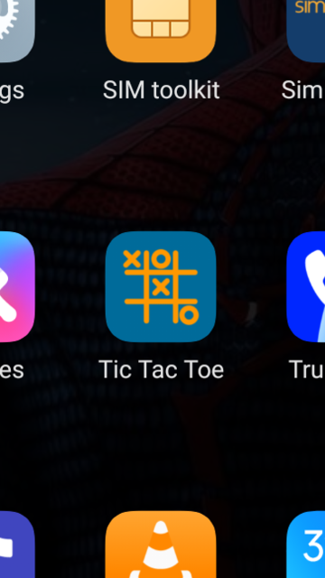

# Tic Tac Toe Android Application

This is a simple Tic Tac Toe game implemented as an Android application using Java.

## Overview

The Tic Tac Toe Android application allows users to play the classic game of Tic Tac Toe against a friend or against the computer. The game features a user-friendly interface and smooth gameplay experience.

## Features

- Play against a friend or against the computer.
- Choose between different difficulty levels for the computer player.
- Simple and intuitive user interface.
- Automatic detection of winning combinations and draws.
- Option to reset the game and start a new match.

## Screenshots



## Installation

1. Clone or download the repository to your local machine.
2. Open the project in Android Studio.
3. Build and run the application on an Android emulator or a physical device.

## Usage

1. Launch the Tic Tac Toe application on your Android device.
2. Choose whether to play against a friend or against the computer.
3. If playing against the computer, select the desired difficulty level.
4. Tap on an empty square to make a move.
5. The game will automatically switch turns between the players.
6. The game will notify you when there is a winner or if the game ends in a draw.
7. To start a new game, tap the "Reset" button.

## Folder Structure
```
/tic-tac-toe-app
    /app
        /src
            /main
                /java
                    /com/example/tictactoe
                        MainActivity.java
                /res
                    /layout
                        activity_main.xml
                    /values
                        colors.xml
```

## Contributing

1. Fork the repository.
2. Create a new branch for your feature or bug fix.
3. Make your changes and ensure the code passes all tests.
4. Submit a pull request with a detailed description of your changes.

## Contact

For questions or feedback, contact [Chhabinath Sahoo](mailto:chhabinath1519@gmail.com).
